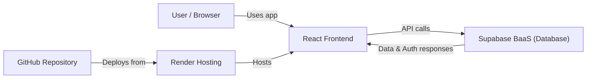

# How is the application hosted?

The application is hosted on [Render](https://render.com/).

We have a free account on render that points to a github repo and contains a run command and some Supabase environment variables.

Here is a diagram, because diagrams are cool.

